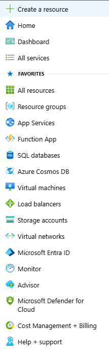
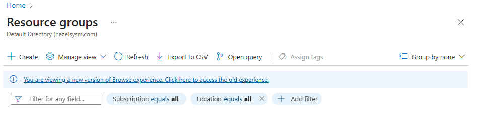
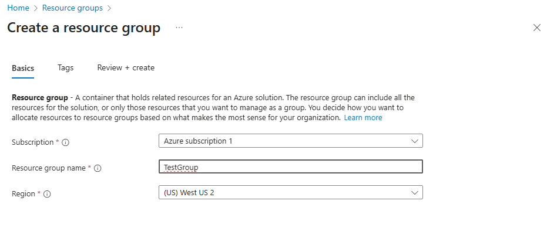
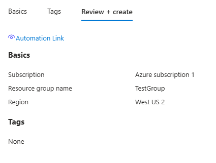

# Azure Powershell Helpers


## Installing AZ Module:

---
```powershell
# Open Powershell as an Admin
Install-Module -Name Az -Scope CurrentUser -Repository PSGallery -Force
```
---

## Login to Azure Account:

---
```powershell
Connect-AzAccount
```
---

## Create Resource Group

---
```powershell
New-AzResourceGroup -Name "Resource Name" -Location "Location"
```
---

## Create Resource Group in Azure

---

- Click Hamburger Dropdown and select Resource Groups:

---


- Click Create and Type in a Name

---


- Click Review & Create

---


- Click Create

---


- Your Group is Created!

---


## Confirm Resource Group

---
```powershell
Get-AzResourceGroup
ResourceGroupName : TestGroup
Location          : westus2
ProvisioningState : Succeeded
Tags              :
ResourceId        : /subscriptions/a63485bf-c8f9-49c4-97d7-30b813966f8e/resourceGroups/TestGroup
```
---

## Basic Script Deployment

---
```powershell
New-AzResourceGroupDeployment `
  -ResourceGroupName "TestGroup" `
  -TemplateFile "testgroupvm.bicep" `
  -TemplateParameterObject @{
    auser="tuser"
    apass="tpass"
  }
```
---


