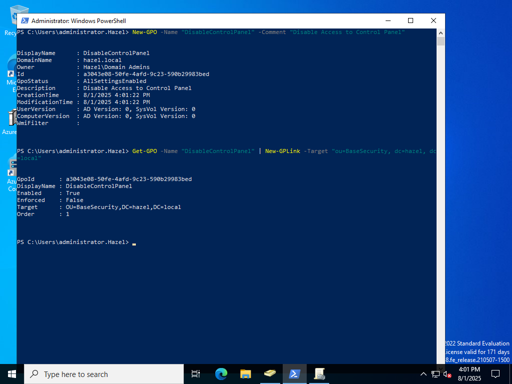
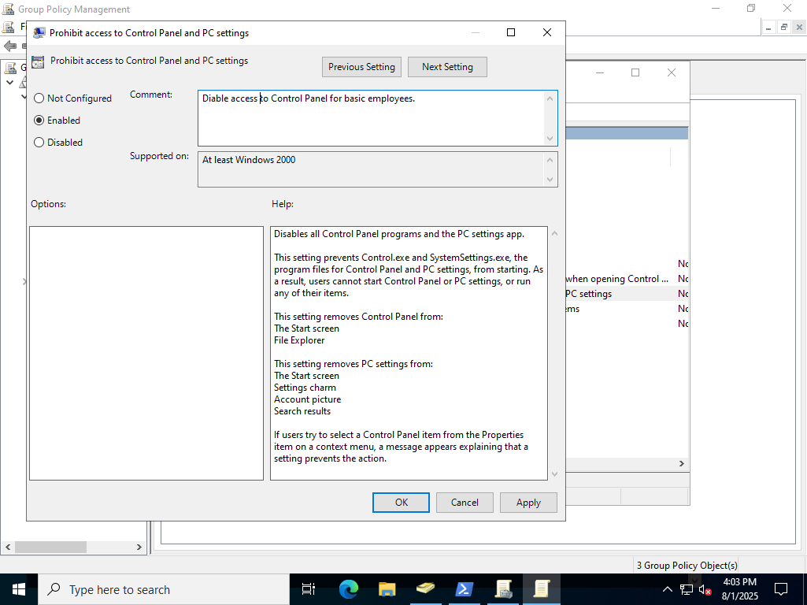
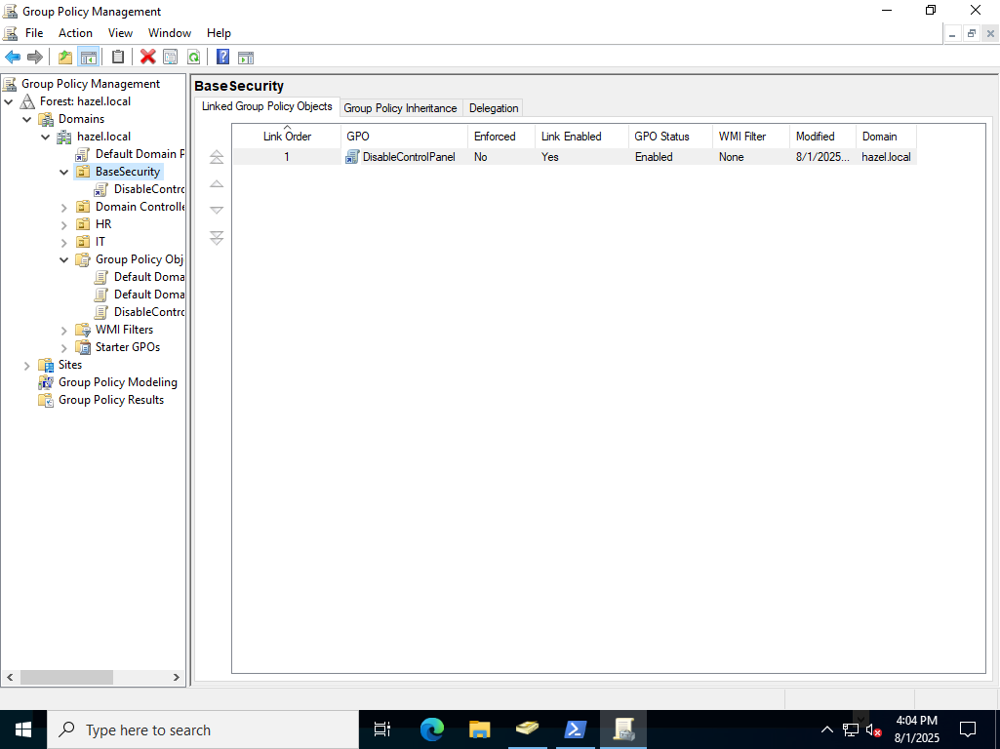
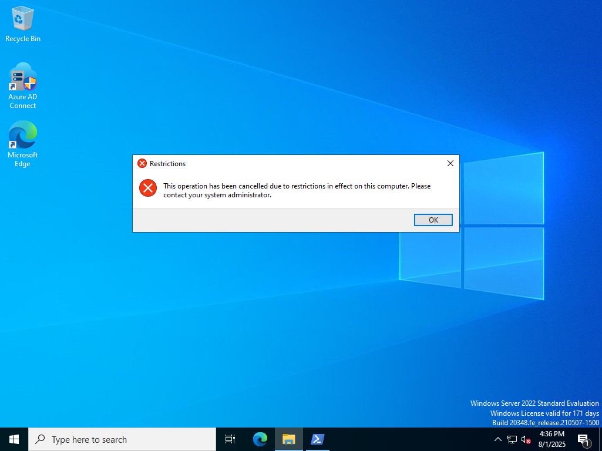

# GPO Testing

---
Testing Group Policy Objects:
  - First: created a very basic gpo with just a name and comment
  - Second: before even deciding what to do in the gpo I link it through powershell to the OU

---
Appling a policy:
  - The policy should now be visible in the Group Policy Management Application
  - Then you can right click it to edit and find what you want to do
  - For the control panel it is pretty straight-forward as there is an adminstrative preset
  - So I went in to the policy called prohibit access to control panel and enabled/applied it

---
Another way to link:
  - While the powershell linking should work most of the time. You can also link it in the GPMC
  - So to do that you simply drag the GPO into the ou you want it to apply to.

---
Trying to use Control Panel:
  - Since this user is a part of the affected OU they are not able to access the control panel!

---
Some thoughts:
  - I had to add the user to the OU since a group member doesn't inherit the group ou gpo's
  - My current plan to make this better would be to automate it.
  - Specifically if they were added to a group with ou they would automatically be added to it on creation and activation.