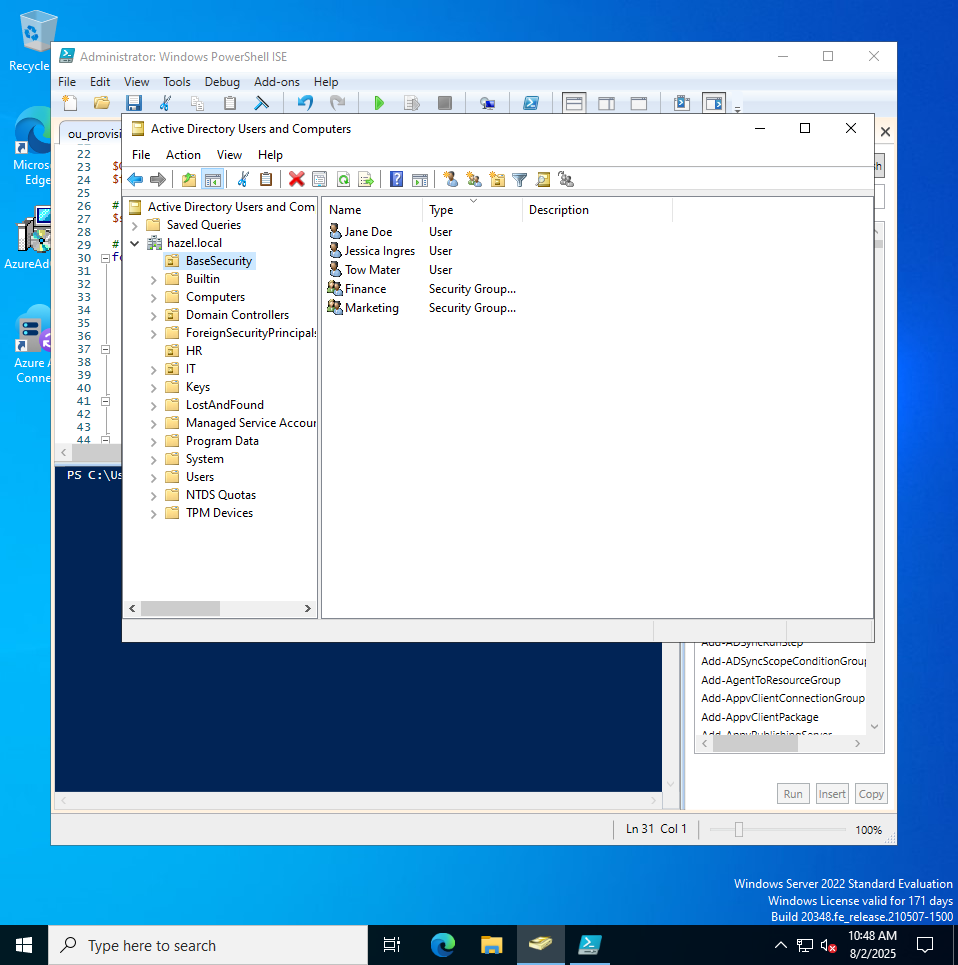
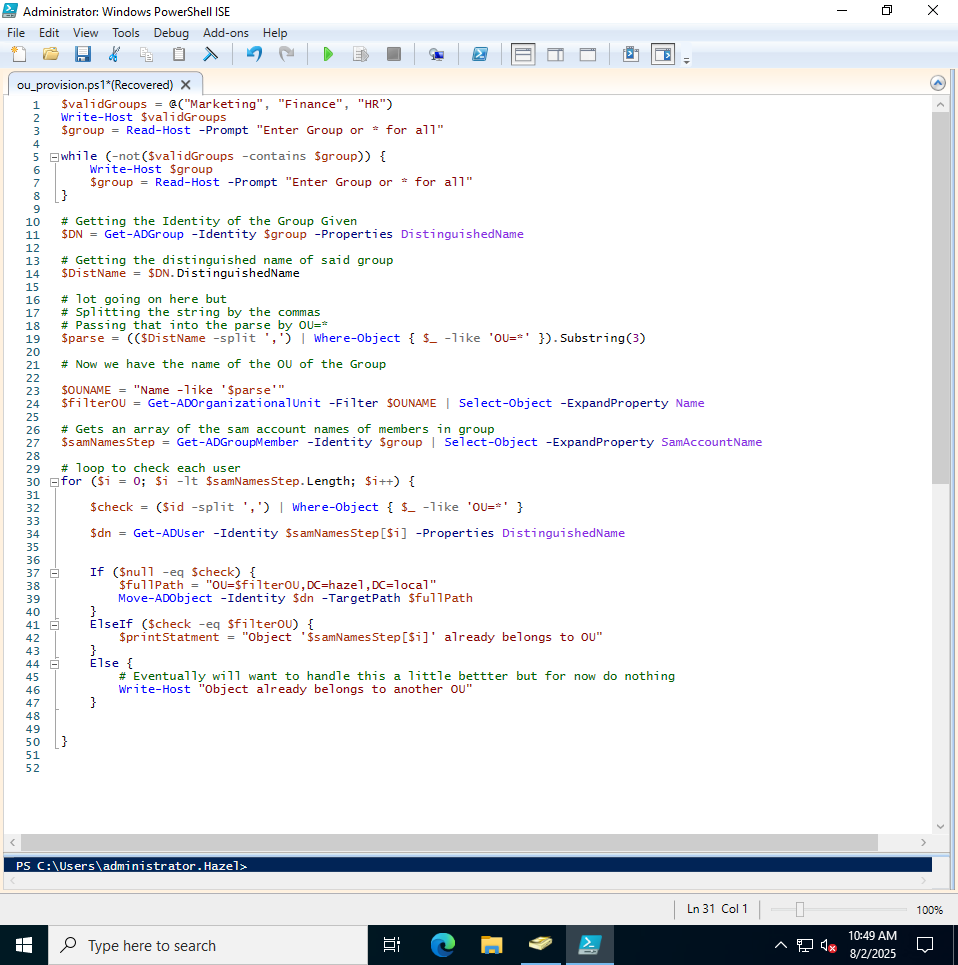
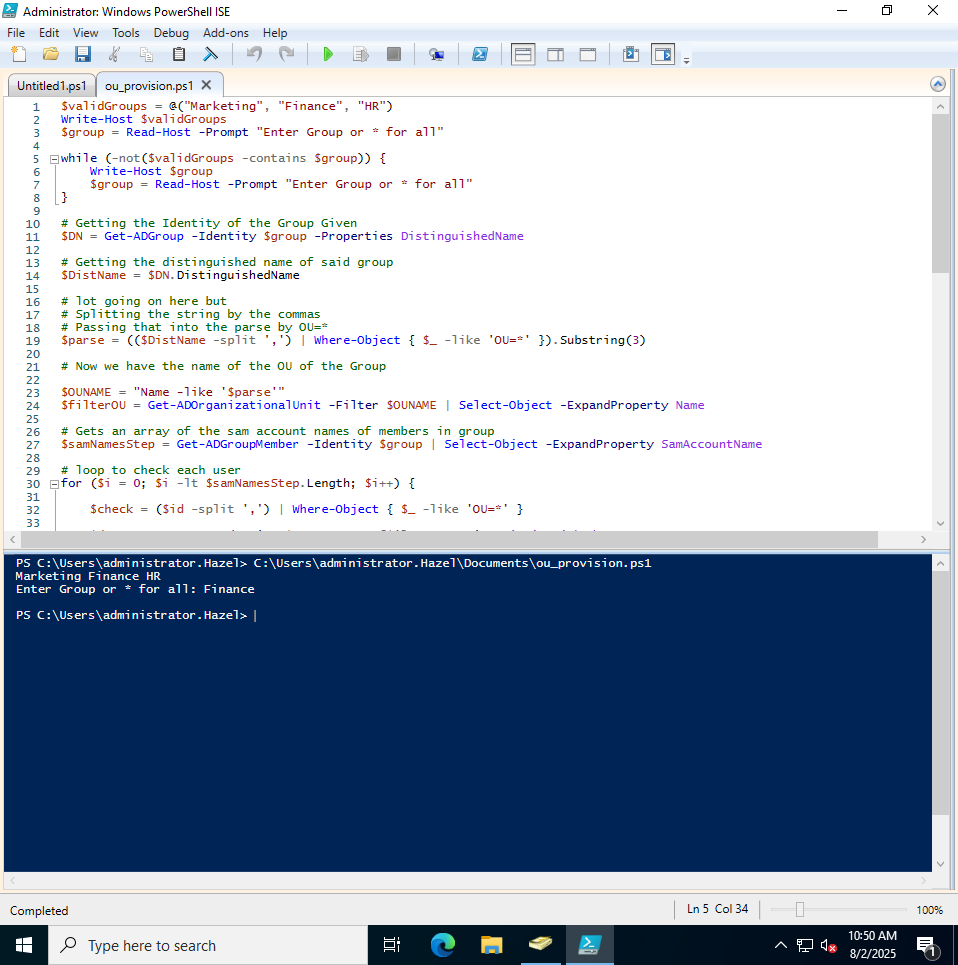
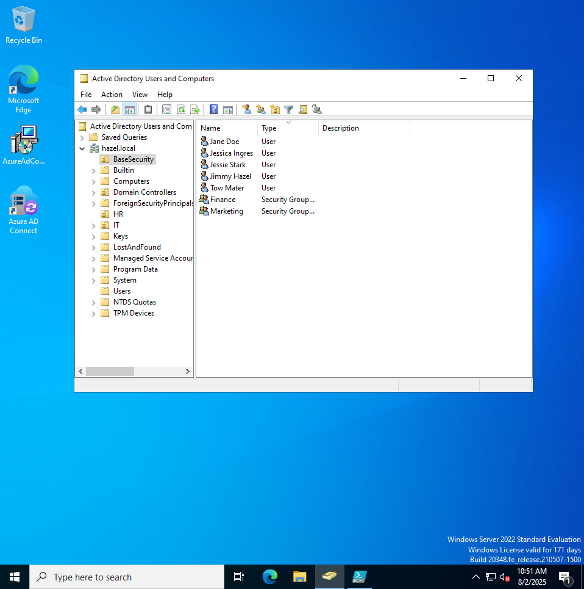

# GPO Automating Group to OU

---

While trying to setup the gpo for [blocking control panel](gpo-testing.md) I ran into a problem.
I had a slight misunderstanding on groups and organizational units so I decided to fix the issue.
By automatically adding users in a group to the ou of their group since its not inherited that way.

---

---

So the marketing department is already set up, but the one member in the Finance Department is not!

---

---

Here is my script:
  - For now it asks which department you would like to fix
  - Then it gets the distinguished name and tries to move the user into the target path
  - If they are already in the OU then noting happens, if they are in another OU they get a warning
  - Finally if they arent apart of any ou then they are added to the groups Organziation Unit

---

---

---

---

Finally as you can see our one member (Jessie Stark) of marketing is now in the OU with their parent group!