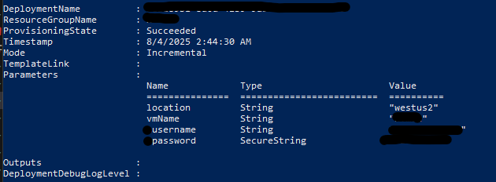
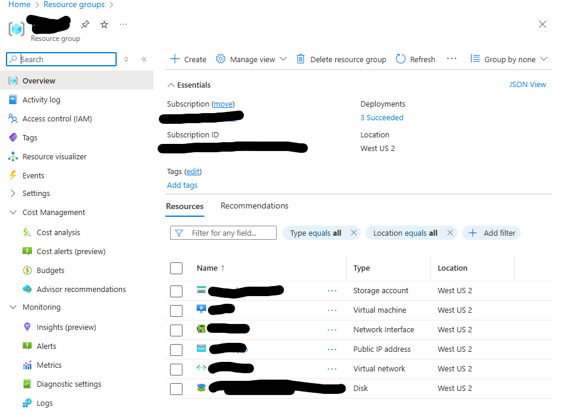

# Infrastructure as Code Deploying A VM

---

## Creating the Resources and [VM](#virtual-machine)

[Deployment](#deployment)

# Paramaters:

---
```bicep
// location of region, for Hazel
param location string = resourceGroup().location
// vm name
param vmName string = 'tname01'
// username to be given as param
param ausername string
// secure pass given as param
@secure()
param apassword string
```
---

Notes:
  - In order to maintain some security I really didn't allow too many hard coded paramaters.
  - Also making sure to define the password param as @secure()

Virtual Machine:

  - So a few things, building a vm resource requrieres a lot of other components
  - Storage for diagnostics
  - Virtual Net
  - Network Interface
  - Public IP (due to free subscription)


## Diagnostic Storage:

---
```bicep
// storage resource for vm diagnostics storage
resource storage 'Microsoft.Storage/storageAccounts@2025-01-01' = {
  name: 'diag${uniqueString(resourceGroup().id)}'
  location: location
  sku: {
    name: 'Standard_LRS'
  }
  kind: 'StorageV2'
  properties: {}
}
```
---

On Dianostic Storage:
  - This is something that I didn't consider you would need while deploying
  - But it is important for boot failures and low level logs

---

## Public IP:

---
```bicep
// static public ip address
resource pip 'Microsoft.Network/publicIPAddresses@2024-07-01' = {
  name: '${vmName}-pip'
  location: location
  sku: {name: 'Standard'}
  // has to be static given free tier
  properties: {
    publicIPAllocationMethod: 'Static'
    
  }

}
```
---

On Public IP (PIP):
  - This is something that I only had to do because of the free subscribtion of azure
  - So I wasn't able to use 'dynamic' allocation for the IPv4

---

## Virtual Net:

---
```bicep
// virtual network for infrasture and vm deployment
resource vnet 'Microsoft.Network/virtualNetworks@2024-07-01' = {
  name: '${vmName}-vnet'
  location: location
  properties: {
    addressSpace: {
      addressPrefixes: [
        '10.0.0.0/16'
      ]
    }
    subnets: [
      {
        name: 'default'
        properties: {
          addressPrefix: '10.0.0.0/24'
        }
      }
    ]
  }
}
```
---

On vNets:
  - The vNet is like a virtual version of a LAN
  - Your VM uses the vNet to communcate with eachother

---

## Network Interface:

---
```bicep
// network interface controller
// attaches vm to a subnet
resource nic 'Microsoft.Network/networkInterfaces@2024-07-01' = {
  name: '${vmName}-nic'
  location: location
  properties: {
    ipConfigurations: [
      {
        name: 'ipconfig1'
        properties: {
          privateIPAllocationMethod: 'Dynamic'
          publicIPAddress: {
            id: pip.id
          }
          subnet: {
            id: resourceId('Microsoft.Network/virtualNetworks/subnets', '${vmName}-vnet', 'default')
          }
        }
      }
    ]
  }
  dependsOn: [
    vnet
    pip
]
}
```
---

On NIC's:
  - Get's a private and public IP from the subnet in our vNet
  - Required for the VM to talk to the network

---

## Virtual Machine:

---
```bicep
// actual virtual machine declaration
resource ubuntuVM 'Microsoft.Compute/virtualMachines@2024-11-01' = {
  name: vmName
  location: location
  properties: {
    hardwareProfile: {
      // modern v2 iso storage
      vmSize: 'Standard_D2s_v3'
    }
    osProfile: {
      computerName: vmName
      adminUsername: ausername
      adminPassword: apassword
      linuxConfiguration: {
        disablePasswordAuthentication: false
      }
    }
    // offer gave me trouble when defining, but it has to match 
    // with sku
    storageProfile: {
      imageReference: {
        publisher: 'Canonical'
        offer: '0001-com-ubuntu-server-focal'
        sku: '20_04-lts-gen2'
        version: 'latest'
      }
      osDisk: {
        createOption: 'FromImage'
      }
    }
    networkProfile: {
      networkInterfaces: [
        {
          id: nic.id
        }
      ]
    }
    diagnosticsProfile: {
      bootDiagnostics: {
        enabled: true
        storageUri: 'https://${storage.name}.blob.${environment().suffixes.storage}/'
      }
    }
  }
  dependsOn: [
    nic
    storage
  ]
}
```
---

On Virtual Machine:

  - First thing were going to do is declare an UbuntuVm resource
  - Then some parameters name and location from our params
  - Then to properties which is what we did all of the dependencies for!

  1. Hardware Profile is the kind of machine were using on the cloud
  2. OS Profile is our admin login information and will be supplied as a parameter.
  3. Storage profile is basically the type of storage drives were using
  -  Note: Hardware Profile and Storage Profile must be compatible.
  4. OS disk is created from our VM Image
  5. Is our network profile, which we set up with the pip, vNet, and nic
  6. Finally our boot diagnostics which we set up earlier as well.

---

## Deployment:

1. Create an azure account
  - [Install Az in Powershell](azps.md#installing-az-module)
2. Create a resource group
  - [In Powershell](azps.md#create-resource-group)
  - [Through the Azure Portal](azps.md#create-resource-group-in-azure)
3. Confirm Resource Group Exists
  - [Confirm Group](azps.md#confirm-resource-group)
4. Deploy Script
  - [Basic Script Deployment](azps.md#basic-script-deployment)
  - Install Bicep if you haven't then run script

---
```powershell
winget install -e --id Microsoft.Bicep
```
---
5. Deployed

Powershell:

---



---

Azure:

---



---

Notes:
  - Can be improved with a json param file. TBD
  - Will need to still [create security groups]()!
