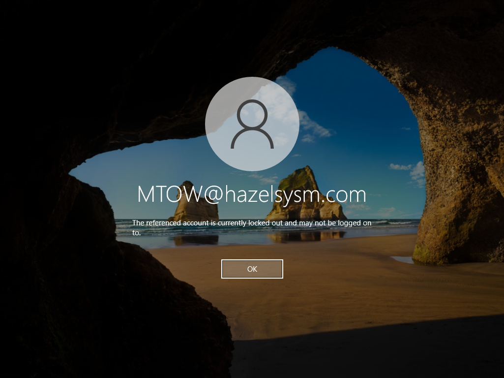
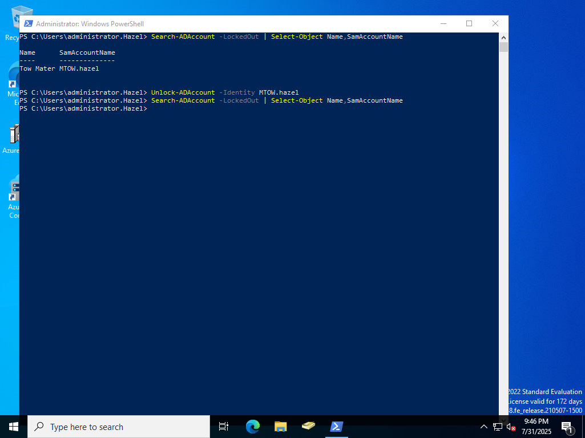
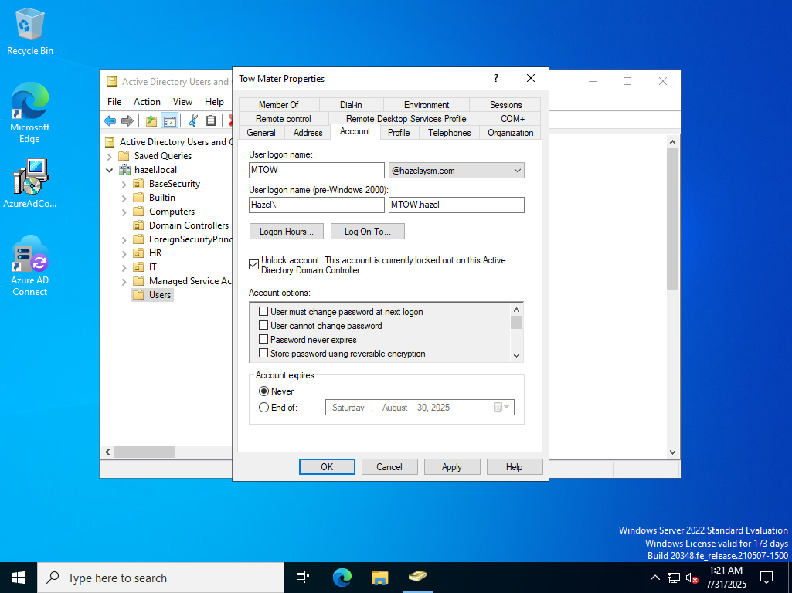

---

---
Our user is locked out of their account after 5 failed login attempts.

I have two options:
- Use Powershell
- Use AD Users & Groups

Using Powershell:
---

- Searching for all accounts that are locked out.
- Unlocking account based on SamAccountName
- Checking to see if the account is still locked out, which it isn't

Using ADUC:
---

- Open Active Directory Users and Computers
- Navigate to the user who is locked out.
- Check Unlock Account and Apply

Potential Improvements:
---

- Automation
- Self Service like on Azure

