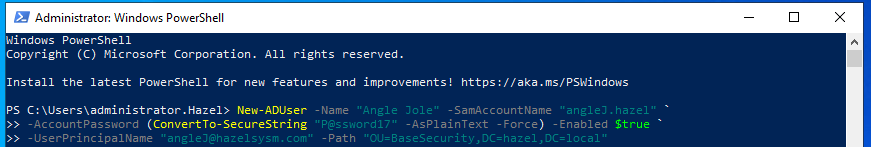
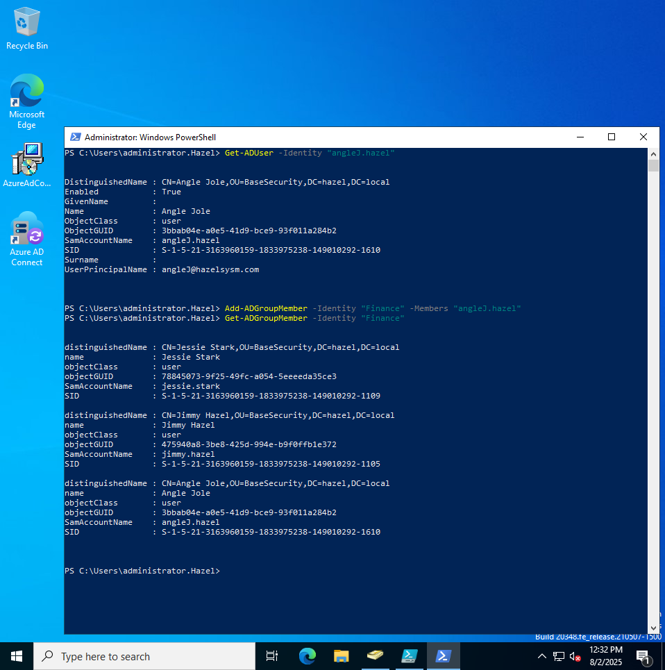
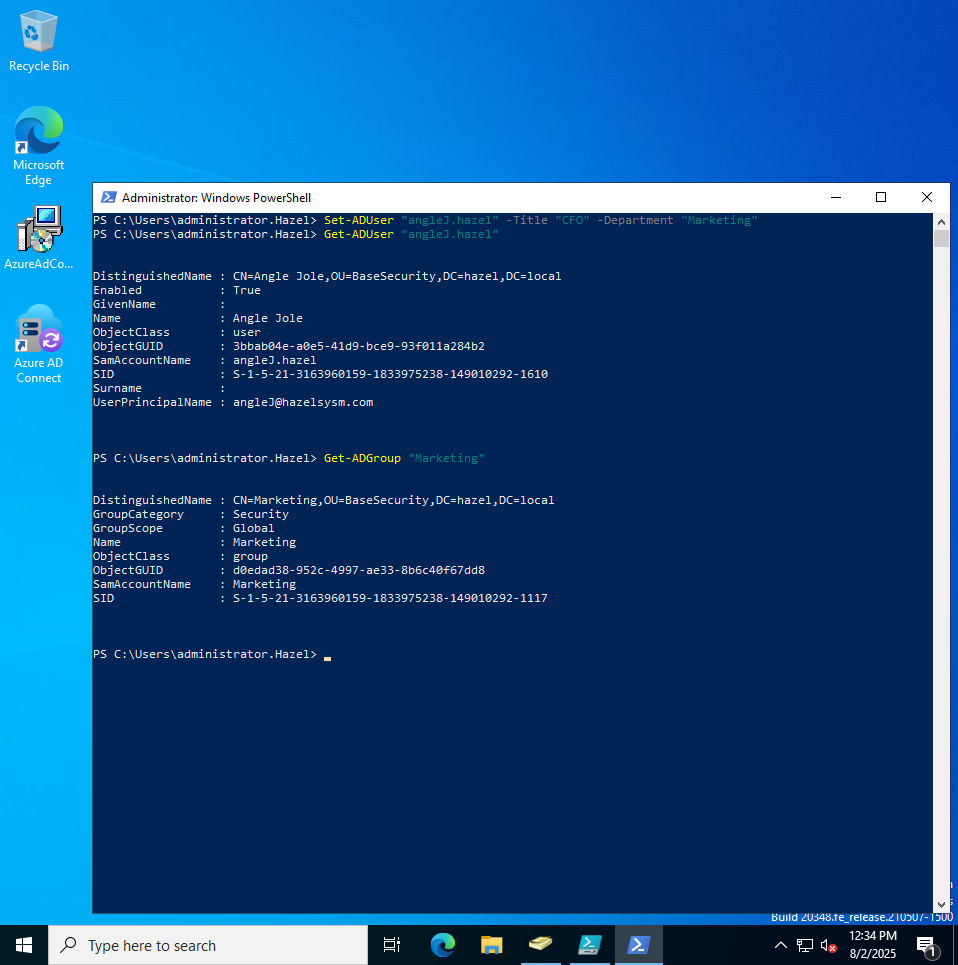
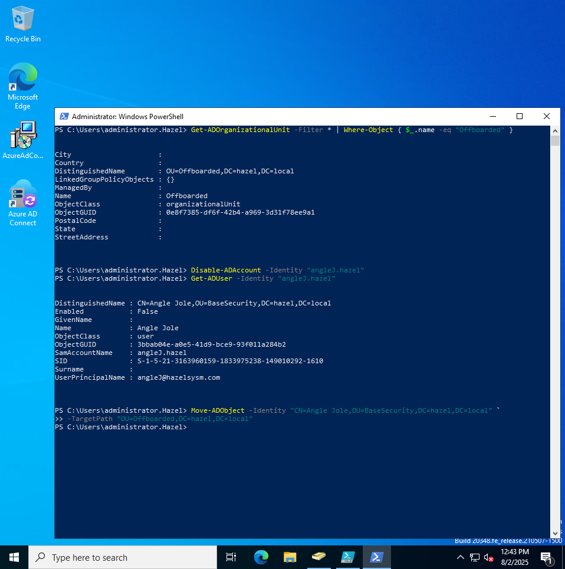
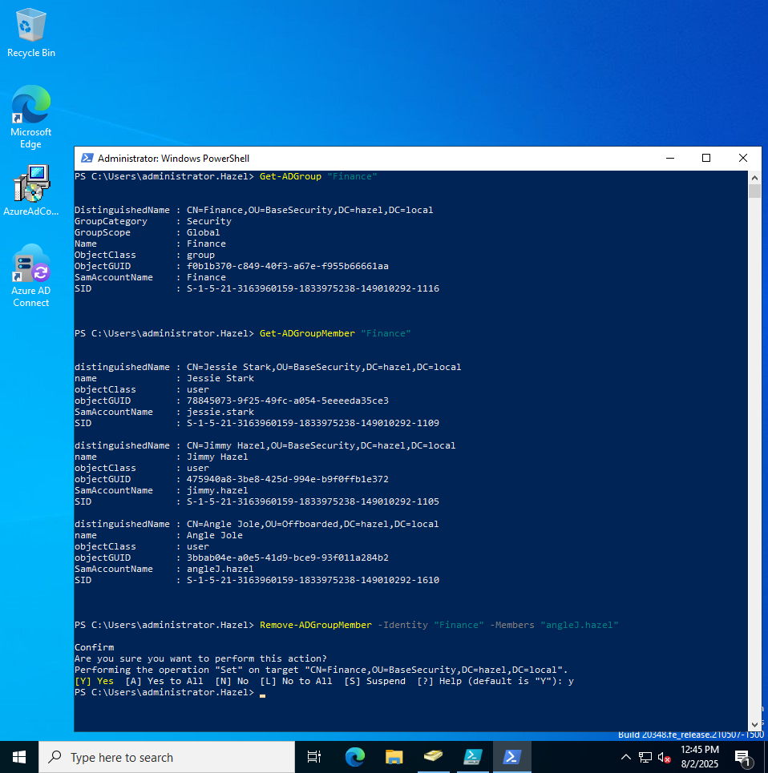

# User LifeCycle AD

Basic user lifecycle:

  - Create User
  - Add to Group
  - Change Role
  - Disable User
  - Remove from Group

Creating User:

---

---

Add to Group:

---

---

Changing Roles:

---

---

Disabling Account:
  - Note: I had to create an OU for terminated employees
  - Then I added Angle to the Offboarded OU

---

---

Deleting From Group

---

---

Notes:
  - May script in future but wanted the basics first
